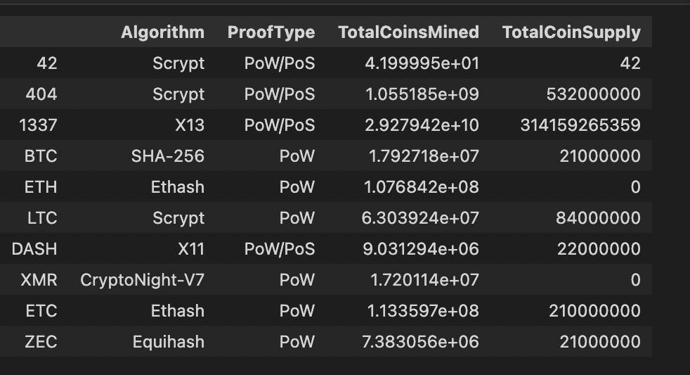
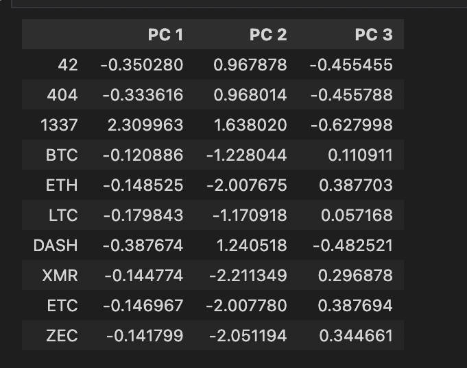
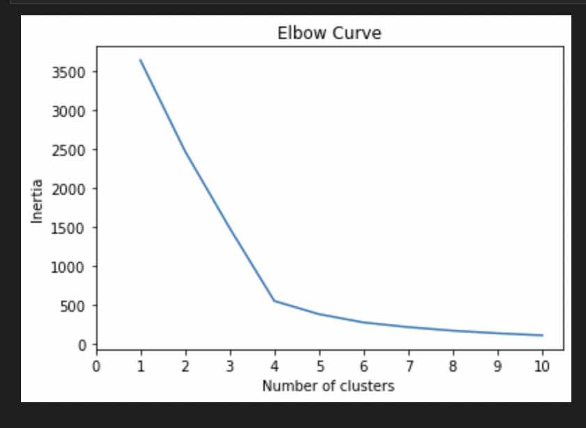
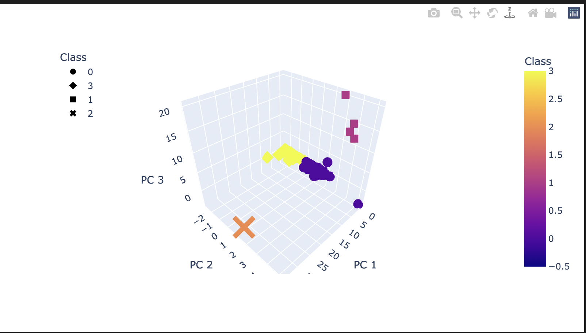
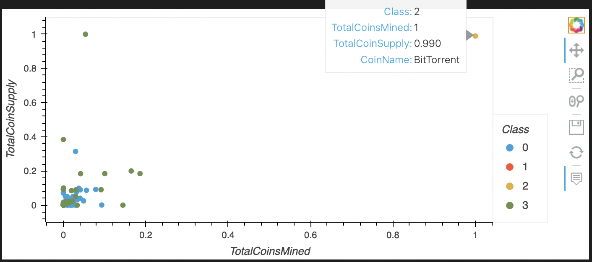

# Cryptocurrencies
## Overview of the Project
This project uses unsupervised machine learning algorithm to create an analysis for cryptocurrency market, and help an investment bank in creating a cryptocurrency investment portfolio for its customer. For that, the project analyses what cryptocurrencies are on the trading market and create a classification system for the investment.

The main purpose of this project are;
- Preprocessing the Data for PCA
- Reducing Data Dimensions Using PCA
- Clustering Cryptocurrencies Using K-means
- Visualizing Cryptocurrencies Results

Data Source:
- crypto_data.csv (retrieved from https://min-api.cryptocompare.com/data/all/coinlist)

## Results
### Preprocessing data for PCA
The imported dataframe after pre-processing with Pandas; 

### Reducing data dimensions using PCA
Dataframe with three principal components after dimension reduction using PCA; 

### Clustering Cryptocurrencies Using K-means
Best value of K using Elbow curve;

Clustered dataframe using predicted clusters and crpytocurrencies features;

### Visualizing Cryptocurrencies Results
3D-Scatter with the PCA data and the clusters;

Tradable cryptocurrencies;

The total number of tradable cryptocurrencies is 532.
